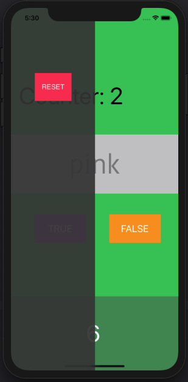
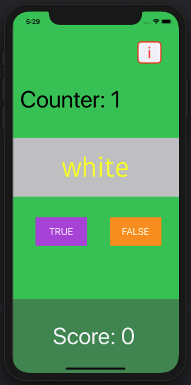
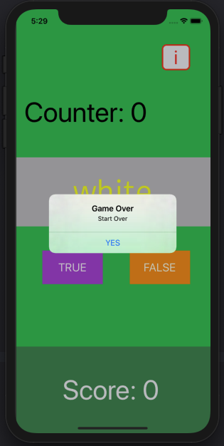
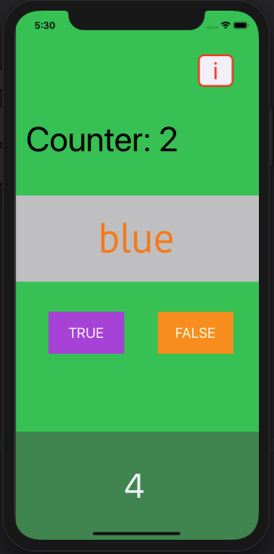

##  Quiz

#### UI/UX:

### Technology:
    * Swift

### Todo:

    * Make count a progrogress instead of string ✅
    * Reset Score UILable.text to 0 when game restart ✅
    * Write reset button funtionality ✅
    * Pause game when sidebar is initiated ✅
    * Add UIProgressHud using Cocoapod when ever user get answer right and wrong. ✅

### Acknowledgement:
   * Samuel Fellado -> iOS Dev ( Make School )
